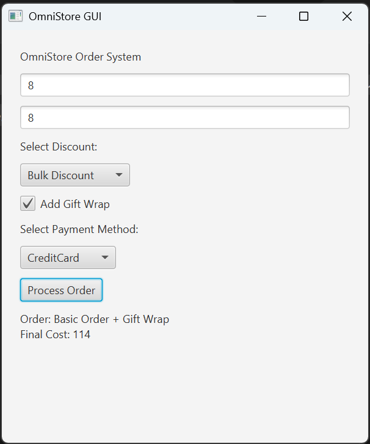

 ** MCS AI, University of Greater Manchester **
** SWE7302-OmniStore ( Desktop application using JAVA)**
**1. Omni-Store Legacy System (Initial Setup) **

This repository will contain the development and refactoring of a legacy
Omni-Store system as part of SWE7302 Advanced Software Development.

The project will demonstrate object-oriented principles and the application
of creational, structural, and behavioral design patterns.
To start with: 

** 2. Problem Overview **
   
Omni-Store is a simple retail system that allows customers to place orders
for products, make payments using different payment methods, and update
inventory levels accordingly. The system supports basic order processing,
pricing, and inventory management.

** 3. Legacy System Description **
   
The initial version of Omni-Store is intentionally designed as a legacy
system. It follows a monolithic structure where a single class is
responsible for handling most of the system’s functionality, including
order processing, payment handling, and inventory updates.

** 4. This design results in: **
   
- Tight coupling between components
- Long conditional (if/else) statements for business logic
- Poor separation of concerns
- Difficulty in extending the system with new features

These issues make the system hard to maintain and violate several object-
oriented design principles.

** 5. Project Aim **
   
The aim of this project is to refactor the legacy Omni-Store system using
object-oriented principles and appropriate design patterns (Creational,
Structural, and Behavioral) in order to improve maintainability,
flexibility, and code quality.

 ** 6. This is GUI, I have created using Java FX: **

To run GUI : ( stay in root folder)
Shows pop up as well: 
Stores data in database: 

** 7.This project: **
Uses JavaFX

Processes order (Strategy + Decorator + Factory)

Inserts into database

Shows result in GUI

Shows success popup

** 8. IMPROVED GUI: **
   

User can choose Discount (Strategy)

User can choose Payment (Factory)

User can optionally add Gift Wrap (Decorator)

Order is stored in database

UI looks clean and user friendly

*** FOR RUNNING THE PROJECT: (stay in root folder) RUN FOLLOWING COMMAND ***

mvn clean javafx:run
