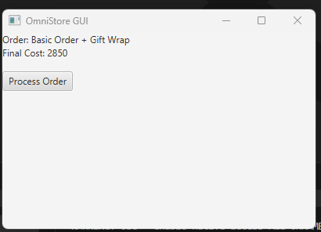
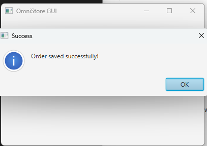
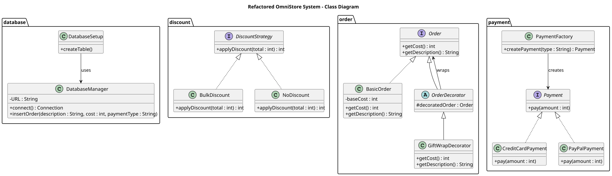
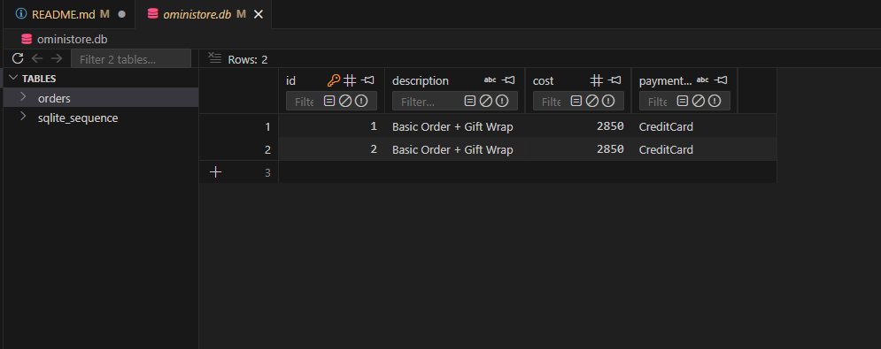

# OmniStore: Refactoring a Legacy System with Design Patterns

A JavaFX desktop retail application that transforms a monolithic legacy system into a modular, maintainable design using object-oriented principles and the **Strategy**, **Factory** and **Decorator** design patterns.

Developed for the *SWE7302 – Advanced Software Development* module, MSc Artificial Intelligence, University of Greater Manchester.

**Tech:** Java 21 · JavaFX · Maven · SQLite · JUnit 5

| Order screen | Order saved |
|---|---|
|  |  |

---

## 1. Problem overview

OmniStore is a simple retail management system that lets customers:

- Place product orders
- Pay using different payment methods
- Apply discounts
- Update inventory levels

The system supports basic order processing, pricing and inventory management.

---

## 2. The legacy system

The original version of OmniStore ([`legacy/OmniStoreManager.java`](legacy/OmniStoreManager.java)) was deliberately designed as a **monolithic legacy system**:

- A single class handles most of the system's functionality
- Order processing, payment handling and inventory updates are tightly coupled
- Business logic relies heavily on long `if/else` chains

### Issues identified

- Tight coupling between components
- Poor separation of concerns
- Difficult to extend with new features
- Violates key object-oriented design principles
- Hard to maintain and scale

---

## 3. Project aim

Refactor the legacy system using object-oriented design principles and creational, structural and behavioural design patterns, to improve:

- Maintainability
- Flexibility
- Code readability
- Scalability
- Overall software quality

---

## 4. Design patterns implemented

| Pattern | Type | Used for |
|---|---|---|
| **Strategy** | Behavioural | Choosing a discount strategy at runtime (`BulkDiscount`, `NoDiscount`) |
| **Factory** | Creational | Creating payment method objects without exposing how they are built |
| **Decorator** | Structural | Adding optional features such as gift wrapping without changing existing classes |

### Refactored class diagram



---

## 5. GUI (JavaFX)

- Customer-friendly order interface
- Choice of discount (Strategy pattern)
- Choice of payment method (Factory pattern)
- Optional gift wrap (Decorator pattern)
- Order confirmation pop-up messages
- Orders saved to an SQLite database

---

## 6. Database

- SQLite database integration; orders are stored persistently
- Database operations are kept separate from the UI logic
- The database file (`oministore.db`) is created automatically the first time the app runs



---

## 7. UML modelling

UML diagrams support the architectural analysis and show the transformation from the legacy system to the refactored design.

### Legacy system

- [Class diagram](docs/uml/legacy-class-diagram.svg): the monolithic structure, with all responsibilities centralised in a single `OmniStoreManager` class
- [Sequence diagram](docs/uml/legacy-sequence-diagram.svg): order processing, discount calculation, payment handling and notification all run inside one class using conditional branching

These diagrams highlight the tight coupling, lack of abstraction and poor separation of concerns in the original implementation.

### Refactored system

- [Class diagram](docs/uml/refactored-class-diagram.svg): modular packages (`discount`, `order`, `payment`, `database`) with interfaces and abstraction
- [Sequence diagram](docs/uml/refactored-sequence-diagram.svg): runtime collaboration between the Strategy, Decorator, Factory and database components
- [UI class diagram](docs/uml/ui-class-diagram.svg) and [UI sequence diagram](docs/uml/ui-sequence-diagram.svg)

Comparing the two sets shows the architectural shift from a monolithic system to a modular, loosely coupled, pattern-driven design.

---

## 8. Unit testing

**JUnit 5** tests validate the core business logic independently of the GUI and database layers ([`BulkDiscountTest`](src/test/java/refactored/discount/BulkDiscountTest.java)).

Boundary conditions tested:

- Discount applied when the total is above 2000
- No discount when the total is exactly 2000 or below
- `NoDiscount` leaves the total unchanged

Because discounts sit behind the `DiscountStrategy` interface, each strategy can be tested on its own, which shows the improved testability of the refactored design.

---

## 9. Running the project

Requirements: **Java 21** and **Maven**.

From the project folder (where `pom.xml` is):

```bash
# Run the app
mvn clean javafx:run

# Run the unit tests
mvn test
```

---

## 10. Project structure

```
src/main/java/refactored/
├── Main.java        # JavaFX interface and entry point
├── database/        # SQLite connection and setup
├── discount/        # Strategy pattern
├── order/           # Decorator pattern
└── payment/         # Factory pattern
src/test/java/       # JUnit 5 tests
legacy/              # Original monolithic system
docs/uml/            # UML diagrams
```

---

## 11. Learning outcomes

- Refactoring legacy systems
- Applying object-oriented principles
- Implementing creational, structural and behavioural design patterns
- Separating concerns between the UI, business logic and data layer
- Building desktop applications with JavaFX

## Author

**Aniqa Arooj**, MSc Artificial Intelligence, University of Greater Manchester
